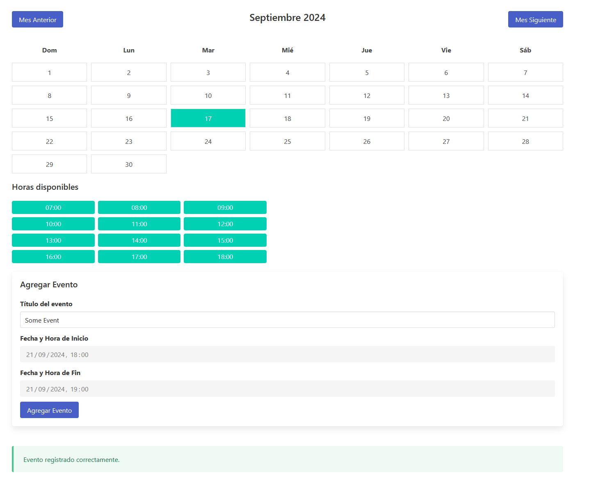

# BookingCalendar

Es una app desarrollada en python y javascript, que permite el booking de eventos que se sincroniza con Google Calendar.

La app funciona dinámicamente y el backend se encarga de enviar al front los dias ocupadas y sus horas, para no mostrarlas en el mismo.

# Requisitos

Es necesaria la creación de 1 archivo `token.json`, el cual contendrá lo siguiente:

```json
 {"token": "sometoken", "refresh_token": "anothertoken", "token_uri": "https://oauth2.googleapis.com/token", "client_id": "client_id", "client_secret": "client_secret", "scopes": ["https://www.googleapis.com/auth/calendar"], "universe_domain": "googleapis.com", "account": "", "expiry": "2024-09-17T19:52:39.429893Z"}
```

# Visualicación


